# Настройка контроллера на примере проекта **BR1_MCA18_Test**.

# Содержание
1. [Обновление прошивки контроллера](#Обновление-прошивки-контроллера)
2. [Создание нового проекта на основе базового](#Создание-нового-проекта-на-основе-базового)
3. [Работа с проектом в среде PLCnext Engineer](#Работа-с-проектом-в-среде-PLCnext-Engineer)
4. [Задание сетевых настроек контроллера](#Задание-сетевых-настроек-контроллера)
5. [Подключение к контроллеру в программе PLCnext Engineer](#Подключение-к-контроллеру-в-программе-PLCnext-Engineer)
6. [Задание пароля](#Задание-пароля)
7. [Копирование Lua-файлов проекта](#Копирование-Lua-файлов-проекта)
8. [Чтение логов](#Чтение-логов)
9. [Запуск проекта](#Запуск-проекта)
10. [Управление ходом выполнения проекта](#Управление-ходом-выполнения-проекта)
11. [Настройка устройств сопряжения с шиной AXL F BK ETH](#Настройка-устройств-сопряжения-с-шиной-AXL-F-BK-ETH)


## Обновление прошивки контроллера

The firmware latest release is located [here](https://www.phoenixcontact.com/online/portal/us/pxc/product_detail_page/!ut/p/z1/3Vdbk5owFP4r7oOPMReudqYPinbVVdet2BVeGAiBTQuEBXQvv75hddtdp9WHHWdamMyQhHO-c85HvhCgC9fQzfwtj_2Ki8xP5Nhxdc_u28Phguj4-kbro_FAs4ZT9SsezQn8Bl3oVn4AHVz3Eh4UfvEEnU3Jsnoi5yF0iIpUohv1WEQLy7qCzgIQDLAK0ItbxauEQccSWVWIJGFFC7R6a6v1pUWwRuTgFeH2aD49CXY83Z0_-svVQ6f8HelveCa5skaXKp6ZwylBN7OZbfcn6mBqE7j8Iwu_CSoYZXzLColUs1OIcEOrAat8npTjiqXj93Qd0peHUSpCtvcWJa_f0zssObbZY7Wfo_THIdcSIvGzeOPHNcyJgnDTClIaVpCCmlZQ0zSkNE1DStM0NGmahiZN09CkcUuuaZtCX_3vCpITm4JDJ3-kQFDAZQrhSzafZOjPr5En0OVB2nmgaQd1pGlnH8zb2Xp5DXbbh44e343GsTxhukcPkT28NzhyCF2yzFstvcXaWi1P8N5V4e2Wswe4ykSRyhP7cld8TR7WWeRjwgALCQKqgTHwUVcFpsaCAFE_MuW3aYRORdA_GOEEvHZW-MV54bXzkqMZZ4WffjT7ydGlPlXr_0f-_f7e7UGXyp-7Wp3remdoowcWtFHqc9ndK6pso4SX1YuiZD9PaCbtvYrRu0wkIn7yqEhzkbGsKr38l7DbKDKMCLEAAeIbMlVEFWDqRhcYYURUDTGihwHM09RU6gZW62ebBc9vmomU_cNd8-Zzbfu2_YMOc-B2x-DSCszZUNHi1Du4lb2Li58JGvCS/?uri=pxc-iframe-integration:firmwaredownload&prodid=2404267).

To update the controller firmware, proceed as follows:

- Download the *.zip firmware file with version **2019.9** at Phoenix Contact [site](https://select.phoenixcontact.com/phoenix/dwl/dwl13a.jsp?fct=dwl&asid=7398668&name=AXC_F_2152_FW2019_9.zip&prodid=2404267&lang=en&hwv=&debug=0).

- Unzip the *.zip firmware file.

- Run the *.exe setup file.

- Follow the instructions of the installation wizard.

When installing, the update file (*.raucb) and PDF files with device-specific information will be copied to the selected destination directory.

- Open your SFTP client software (e.g. **WinSCP**).

- Log in as an administrator.

The following access data is set by default:
```
User name: admin
Password: Printed on the controller.
```

<p align="center">

</p>
<p align="center"> Pic. Password location </p>

- Copy the *.raucb update file to the /opt/plcnext directory (home directory of the Linux user “admin”).

- Open the shell using a command line tool (e.g. **PuTTY**).

- Log in as an administrator.

The following access data is set by default:
User name: admin
Password: Printed on the controller (see Figure 3-2).

- Switch to the /opt/plcnext directory (command: “cd /opt/plcnext”).

- To start the firmware update, enter the command:
```sh
sudo update-axcf2152
```

You will be asked to enter the administrator password.

- Enter the administrator password.

The firmware will be updated. During the firmware update, the RUN LED begins to flash, and then stops.
Following this, the controller is restarted. Once the controller has been fully initialized, the RUN LED lights up permanently.
The update file is deleted automatically from the */opt/plcnext* directory.

## Создание нового проекта на основе базового ##

Копируем каталог проекта *PLCnext*, который находится здесь - **p:\PTUSA projects\projects\default\PLCnext** - в каталог требуемого проекта в подкаталог **PLCnext**.

## Работа с проектом в среде PLCnext Engineer ##

Запускаем PLCnext Engineer, открываем файл проекта, который находится в данном каталоге - *p:\PTUSA projects\projects\BR1_MCA18_Test\PLCnext\Ptusa.pcwef*.

Открываем свойства проекта (двойной щелчок мышью по элементу дерева **Project**) - здесь мы видим текущие сетевые настройки для устройств проекта (контроллеров и узлов ввода\вывода).

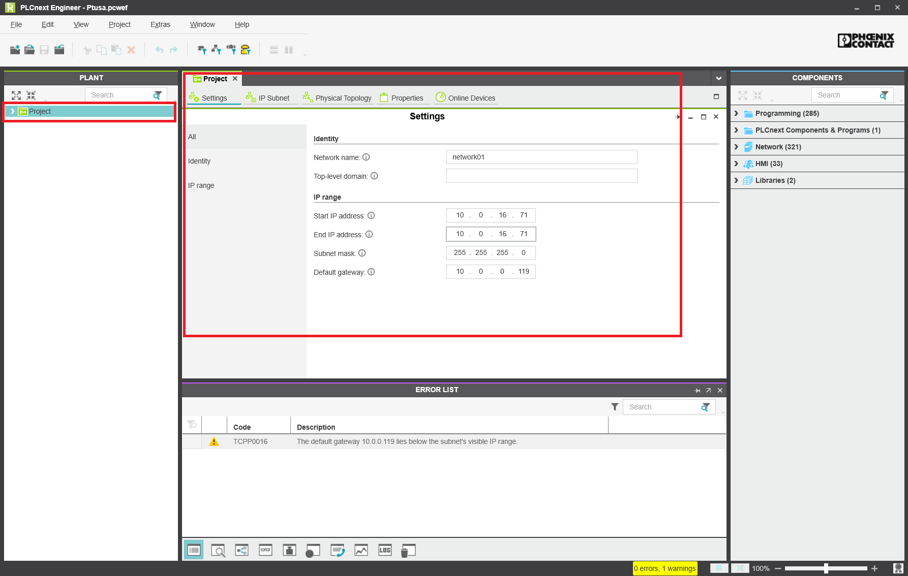
<p align="center"> Рис. Задание настроек сети </p>

При необходимости меняем сетевые настройки устройств проекта на данной странице.

На вкладке **IP Subnet** отображаются настройки контроллера проекта (также их можно редактировать):

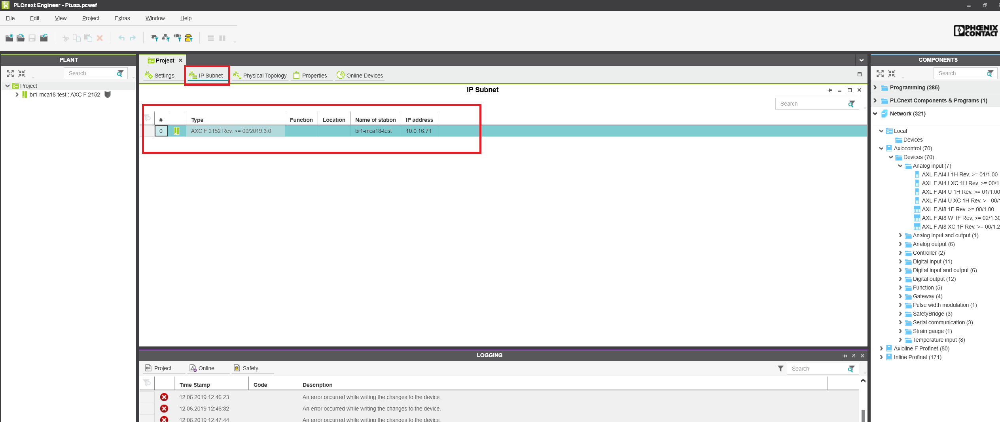
<p align="center"> Рис. Задание настроек подсети </p>

## Задание сетевых настроек контроллера

Подключаем контроллер к питанию и сети. Переходим к вкладке **Online Devices** и нажимаем кнопку *Scan the network*:

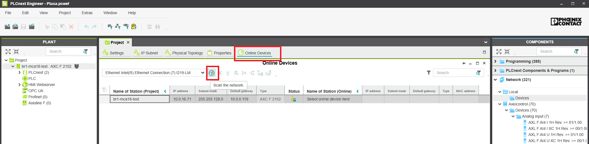
<p align="center"> Рис. Поиск контроллера </p>

После успешного поиска в данном окне отобразятся найденные устройства - должен появиться подключенный контроллер с настройками по умолчанию:

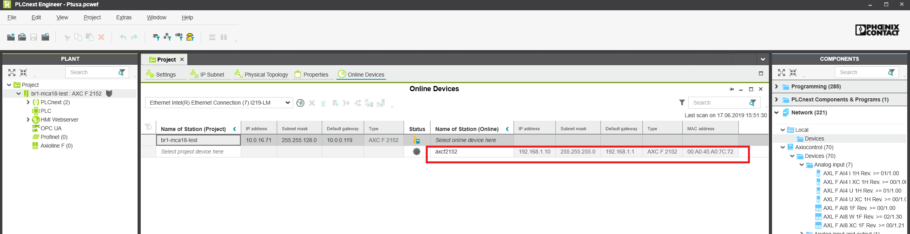
<p align="center"> Рис. Найденные контроллеры </p>

Указываем для найденного контроллера его соответствие в проекте:

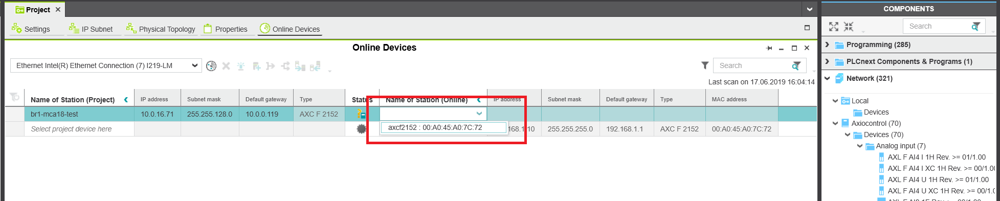
<p align="center"> Рис. Добавление контроллера </p>

Данный контроллер добавится в проект и сконфигурируется, через некоторое время он отобразится с новыми настройками:

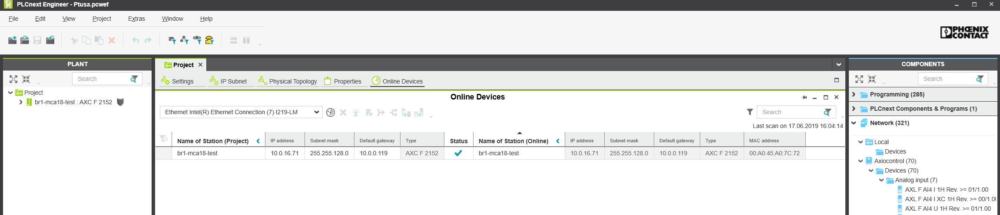
<p align="center"> Рис. Контролеры в проекте </p>

## Подключение к контроллеру в программе PLCnext Engineer

Переходим на вкладку с настройками контроллера:

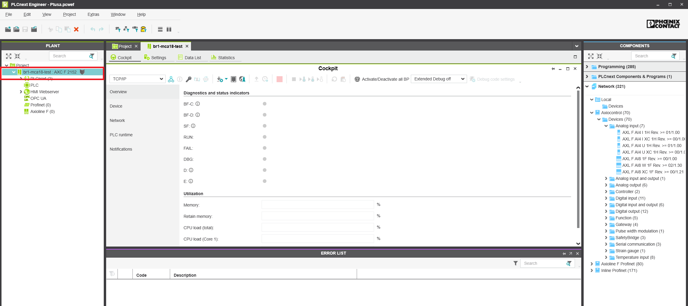
<p align="center"> Рис. Обзор контроллера </p>

Далее нажимаем на кнопку подключения:

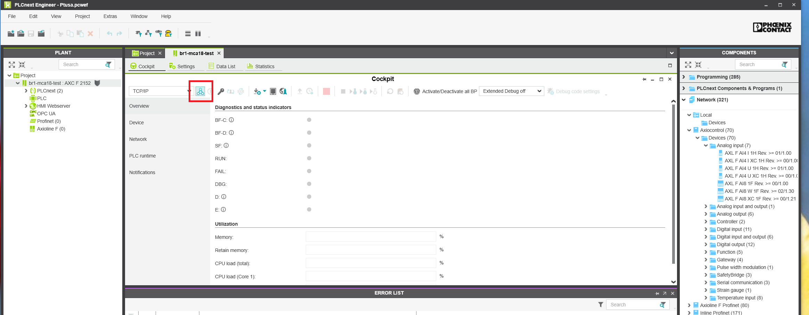
<p align="center"> Рис. Подключение к контроллеру </p>

Далее вводим имя пользователя (admin) и пароль (напечатан на корпусе контроллера). После успешного подключения отображаются текущие параметры контроллера:

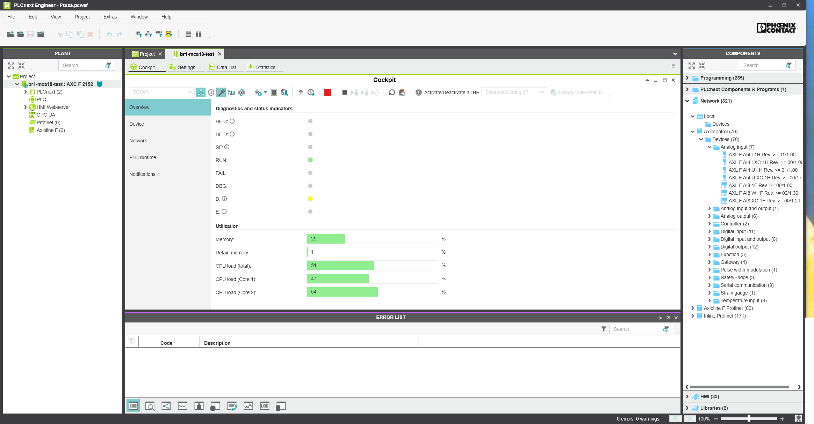
<p align="center"> Рис. Подключенный контроллер </p>

## Задание пароля

Нажимаем на кнопку изменения пароля и задаем новый пароль для пользователя **admin** - **ptusaadmin**:

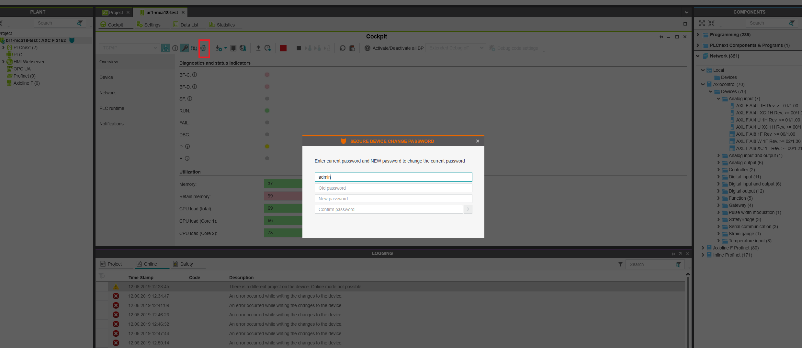
<p align="center"> Рис. Изменение пароля</p>

## Копирование Lua-файлов проекта

Необходимо через **FTP** интерфейс записать файлы конфигурации проекта на контроллер в каталог **/opt/main**.

Для этого предлагается использовать программу [WinSCP](https://winscp.net/eng/index.php). Путь к программе:

>L:\IT\WinSCP\WinSCP.exe

Выбираем файлы проекта, которые необходимо записать на контроллер. Данные файлы находятся в следующем каталоге: **P:\PTUSA projects\projects\Название проекта**. Список файлов, описывающих проект:

- __*main.plua*__ - описание управляющей программы;
- __*main.wago.lua*__ - описание привязки устройств к модулям Wago;
- __*main.devices.lua*__ - список всех устройств;
- __*main.modbus_srv.lua*__ - описание взаимодействия с modbus-клиентами;
- __*main.objects.lua*__ - описание объектов проекта;
- __*main.profibus.lua*__ - описание profibus;
- __*main.restrictions.lua*__ - описание ограничений;
- __*main.rm_PACs.lua*__ - описание взаимодействия с удаленными PAC.

Копируем данные файлы на контроллер. Также необходимо скопировать системные файлы из каталога **p:\PTUSA projects\system scripts**. Список системных файлов:

- __*sys.devices.lua*__ - описание устройств;
- __*sys.objects.lua*__ - описание объектов;
- __*sys.rm_PACs.lua*__ - удаленная работа с другими *PAC*;
- __*sys.wago.lua*__ - описание модулей ввода-вывода *Wago*;
- __*tank.lua*__ - описание типового технологического *аппарата* **танк**;
- __*mixer.lua*__ - описание типового технологического *агрегата* **узел перемешивания**;
- __*master.lua*__ - описание типового технологического *аппарата* **мастер проекта**;
- __*line.lua*__ - описание типового технологического *агрегата* **линия**;
- __*cooler.lua*__ - описание типового технологического *агрегата* **узел охлаждения**;
- __*boiler.lua*__ - описание типового технологического *агрегата* **узел нагрева**.

## Чтение логов

Для чтения сообщений от управляющей программы подключаемся по ssh (используя **Kitty**) и используем следующую команду:

```sh
tail -F /var/log/messages | awk '
  /info/ {print "\033[32m" $0 "\033[39m"; next}
  /warn/ {print "\033[33m" $0 "\033[39m"; next}
  /err/ {print "\033[31m" $0 "\033[39m"; next}
  1 {print}
  ' | grep ptusa
```

## Запуск проекта

Нажимаем кнопку **Записать и начать выполнение**:

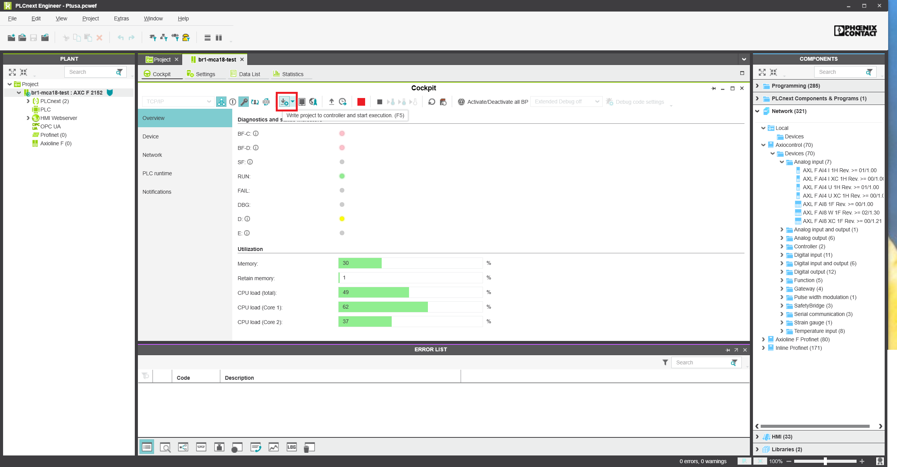
<p align="center"> Рис. Запуск проекта</p>

При успешном запуске в окне просмотра логов не должно быть аварийных сообщений:

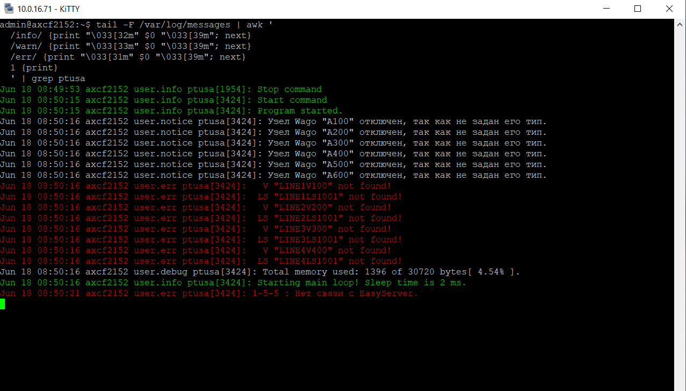
<p align="center"> Рис. Просмотр сообщений </p>

## Управление ходом выполнения проекта

Для перезапуска необходимо выполнить следующую команду в консоли:

```sh
sudo /etc/init.d/plcnext restart
```

Для остановки и запуска проекта необходимо выполнить следующие команду в консоли:

```sh
sudo /etc/init.d/plcnext stop
sudo /etc/init.d/plcnext start
```

## Настройка устройств сопряжения с шиной *AXL F BK ETH*

### Задание IP-адреса

Скачать с сайта Phoenix Contact утилиту [BootP IP addressing tool](https://www.phoenixcontact.com/online/portal/us/pxc/product_detail_page/!ut/p/z1/5Vddc6IwFP0r7oOPmPCNj0DdVYrWVtwKL5kAwc0uX4VoP359g2V3i7PV2en4BJMZEsi5955zOU4EAdiAIMd7usWMFjlO-doPNORZ3mSylDTx5la14OxKtSeucidOFxL4DgIQ1CQlESOxjRnZFtUz8E3XbV4wHAJfbGZlFP0C_lKQREGUmwcpDSvcbN3VJD_soDHwJc0wFHXcrItkadvXHQyjLCXAt3b1ICp2ZUqqgTAwN-7g68C6Hky8KV_-jnB_snKTF3Wa2BsefnCZ8Bze53gdGdK1Pf2miHNj4krwdj73PMtRrlxPAqt_qvBXsYpEhO5JxSM16lRFvIvYFWGYpvWMkWzWlevDHhzrWsZJVsSkDVvUtGl1Jwlfe-SJtc-OG8fxKc63O7xtYpyhKfaDptwLmjLsB81-eFPuhzflfnjT6Yc3nX540-nJR9uPnyBL4TR9G_ja9sd0tgUOCGiYjR6jbARH5VM0ajOi-MALlU1QfvKmPx8eAhMEUZGzppJNI88QPpJwCDNM-bQF1kOY0podgHxuF1lZ5CRnNUqKCi1dG-E8RrMbVD_XXLMatUSGUB7HsaJiKESiQgRFlaAQEknnMy3WtURMdB3zo3Bw8rRriu2GE6flFcnReoWWG3u9OiPXWAH3e0oewTovqoz_CVm9daDpYDIOeb0GFBKVM1BEVRRwPFYEAommxpDoiT4GU3gug_bJDGfCqxcNv7xsePWy4qj6RcO7n63eOfmpu8pnjBl1jVmm0cGYtPhjzPK_jFlmmSG3Q1hvXjwSvrwfybv3bwMtFuq-MwTcxZDQgPIRTC33R7ALphKCULsz5hNZ8Z39i7UQurfAN7-8AlmIudU!/p0/IZ7_82KCHG41M8EL20QMMTTBJ4DLJ0=CZ6_TBTEEP261OQ5B0ID5CEL4R1HN2=LA0=EdownloadId!4009557=action!downloadFile==/#Z7_82KCHG41M8EL20QMMTTBJ4DLJ0) для настройки. После запуска данной утилиты открывается главное окно:

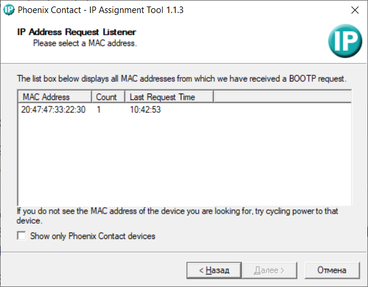
<p align="center"> Рис. Утилита IP Assignment</p>

Рекомендуется установить галочку *Show only Phoenix Contact devices*.

Далее в списке обнаруженных устройств (посылающих запрос BootP) необходимо выбрать требуемое (MAC адрес устройства должен соответствовать MAC адресу, который напечатан на корпусе настраиваемого узла BK ETH). Через двойной клик по необходимому устройству переходим к окну настройки:

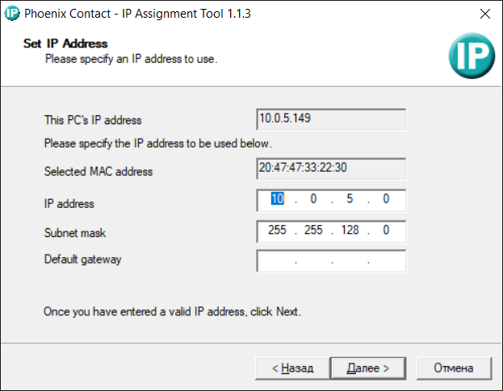
<p align="center"> Рис. Настройка сетевых параметров</p>

Задаем требуемые настройки и записываем их в устройство.

### Настройка IO-Link модуля IOL 8

Для настройка данного модуля необходимо вместо устройства сопряжения с шиной *AXL F BK ETH* подключить контроллер *AXC F 2152* и использовать для настройки *PLCnext Engineer*.

Базовый проект для настройки хранится в [p:/PTUSA projects/projects/default/PLCnext configure IOL 8/ptusa_IOL8.pcwef](file:///p:/PTUSA%20projects/projects/default/PLCnext%20configure%20IOL%208/ptusa_IOL8.pcwef). По умолчанию в нем задан IP-адрес контроллера *10.0.16.55* (необходимо менять если используется контроллер с другим IP-адресом) и следующая конфигурация шины *Axioline F*:

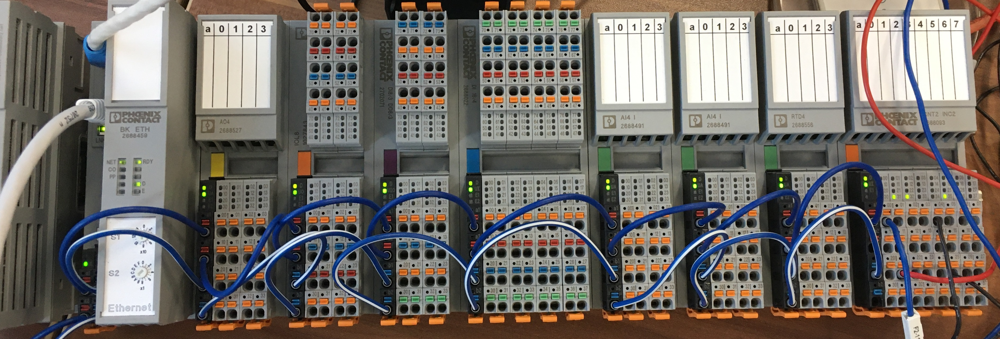
<p align="center"> Рис. Типовая конфигурация шины <i>Axioline F</i></p>

Открываем данный проект, переходим на вкладку *Axioline F*:

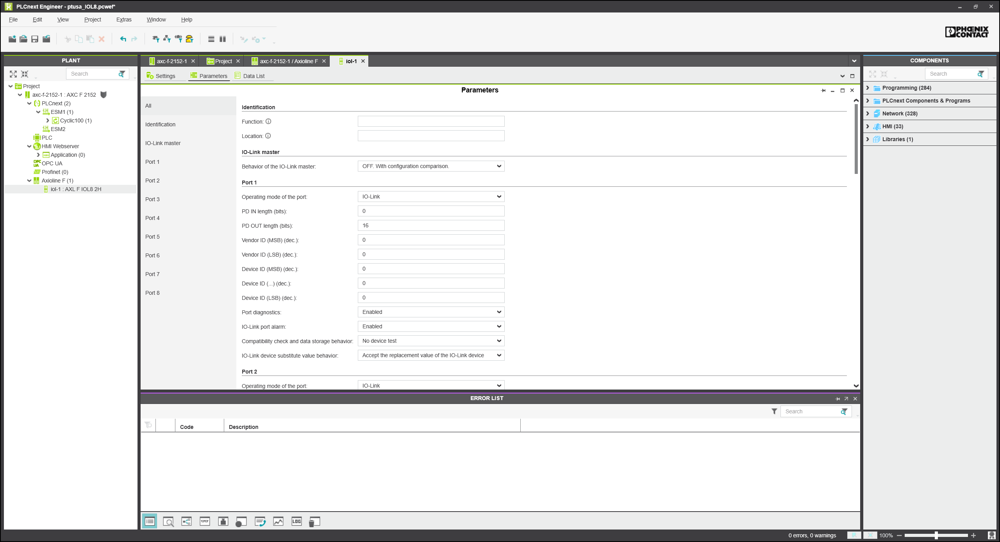
<p align="center"> Рис. Настройка IOL8</p>

При необходимости меняем конфигурацию шины *Axioline F* так, чтобы она соответствовала реальной.

По умолчанию заданы следующие настройки для IO-Link портов:

**#1** - IO-Link, устройство пневмоостров **Festo VTUG8** (поле *PD OUT lengths bits* - значение *16*);  
**#2** - IO-Link, устройство предельный уровень **IFM LMT100** (поле *PD IN lengths bits* - значение *16*);  
**#3** - IO-Link, устройство предельный уровень **IFM LMT100** (поле *PD IN lengths bits* - значение *16*);  
**#4** - IO-Link, устройство предельный уровень **IFM LMT100** (поле *PD IN lengths bits* - значение *16*);  
**#5** - IO-Link, устройство датчик давления **IFM PI2715** (поле *PD IN lengths bits* - значение *16*).

Если необходимо подключить другие устройства, то нужно задавать для соответствующего порта настройки полей *PD IN lengths bits* и *PD OUT lengths bits*. Их можно узнать в документации на устройство от производителя (для **IFM PI2715**, например, это находится [здесь](https://www.ifm.com/download/files/_ifm-0002D8_V235-20170517-IODD101-en/$file/_ifm-0002D8_V235-20170517-IODD101-en.pdf)).

После конфигурирования сохраняем проект и записываем его в контроллер (кнопка **"Write project to controller and start execution. (F5)"**):

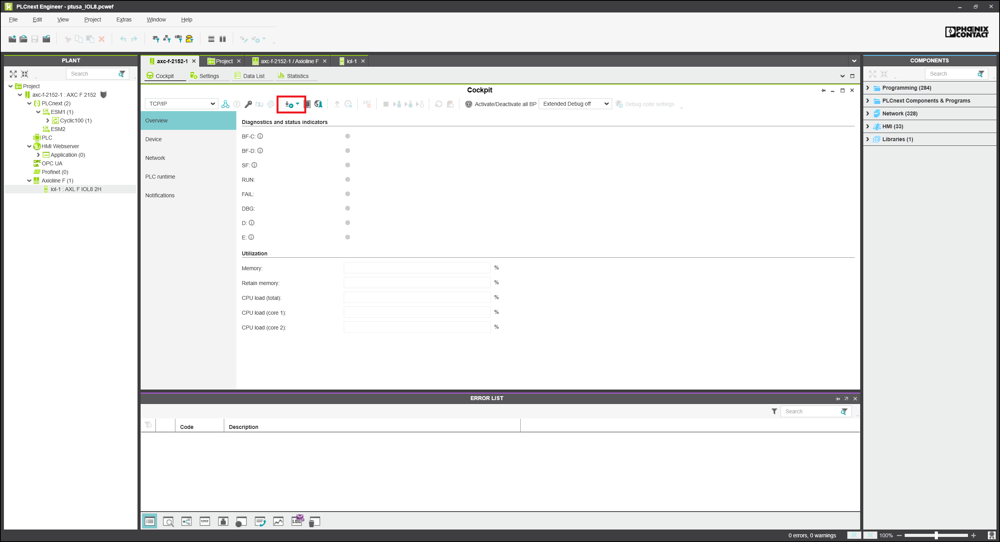
<p align="center"> Рис. Запись настроек шины <i>Axioline F</i></p>

После успешной записи на модулях должны гореть зеленые индикаторы на активных портах *IO-Link* (**30-33**, **70-73**). При подключенных правильно устройствах они должны мигать - значит идет обмен с устройством:

<p align="center">
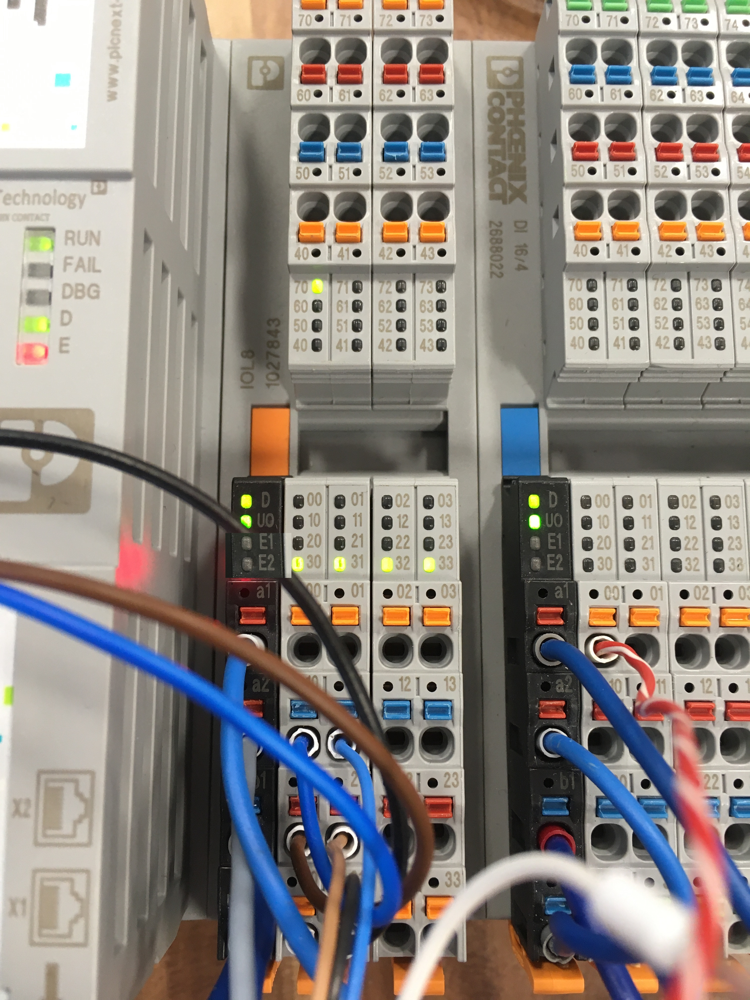
</p>
<p align="center" height="400"> Рис. Индикаторы <i>Axioline F</i></p>

Далее отключаем контроллер и устанавливаем устройство сопряжения с шиной *AXL F BK ETH*.

### Конфигурирования локальной шины *Axioline F*

Подключаемся к устройству сопряжения с шиной *AXL F BK ETH* через web-интерфейс (используя web-браузер). После успешного подключения отображается стартовая страница:

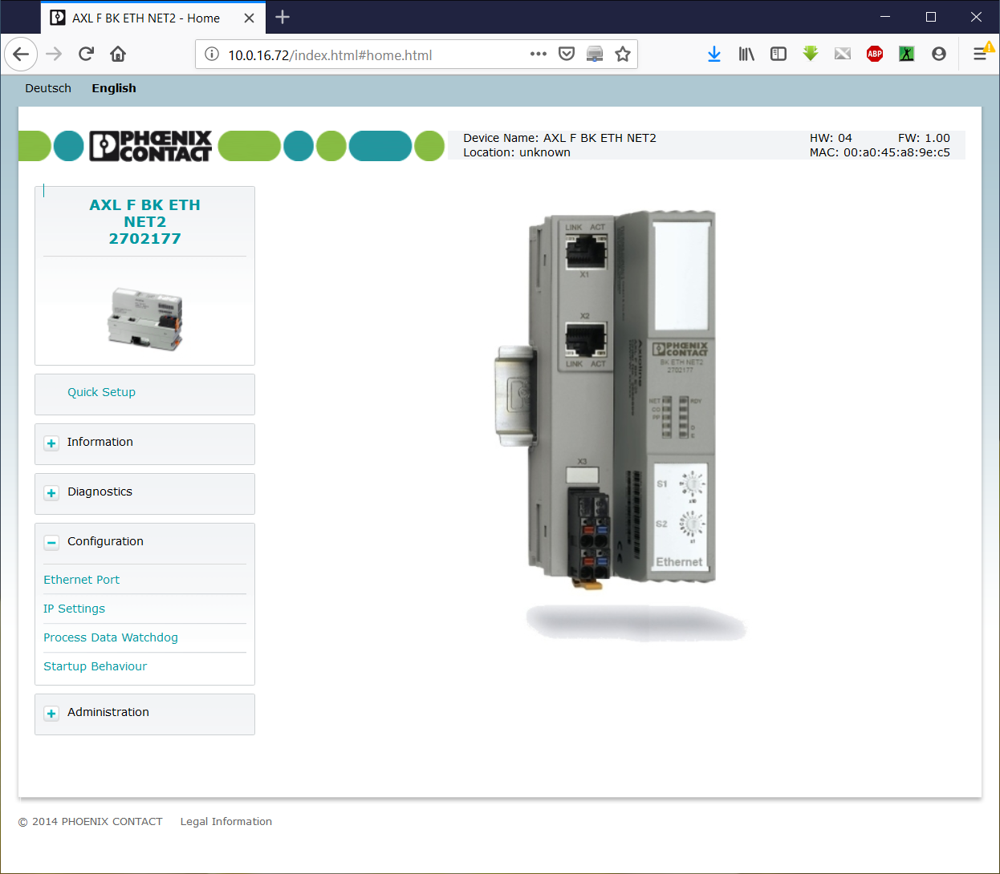
<p align="center"> Рис. Успешное подключение к AXL F BK ETH </p>

Переходим на вкладку *"Startup Behaviour"* и устанавливаем флажок *"Run in plug and play mode after next restart"*:

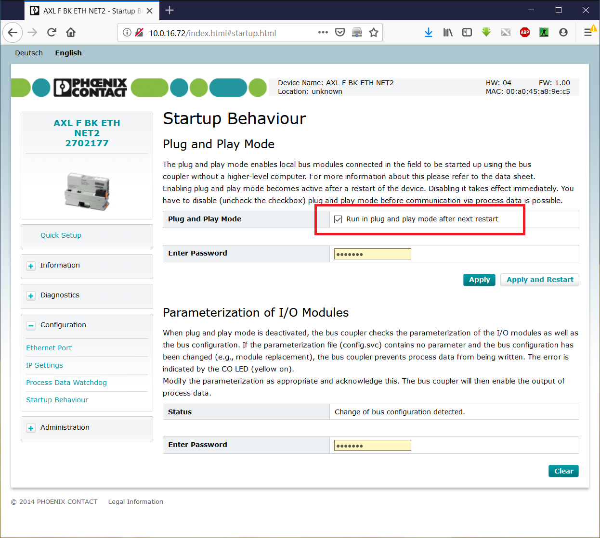
<p align="center"> Рис. Успешное подключение к AXL F BK ETH </p>

Далее нажимаем кнопку *"Apply and restart"*. Настройки запишутся в устройство, страница перезагрузиться. Снимаем флажок *"Run in plug and play mode after next restart"* и опять нажимаем кнопку *"Apply and restart"*. Устройство и web-страница перезагрузятся. Далее переходим на вкладку *"Modbus I/O Table"*, где должно быть отображено корректные модули шины *Axioline F*:

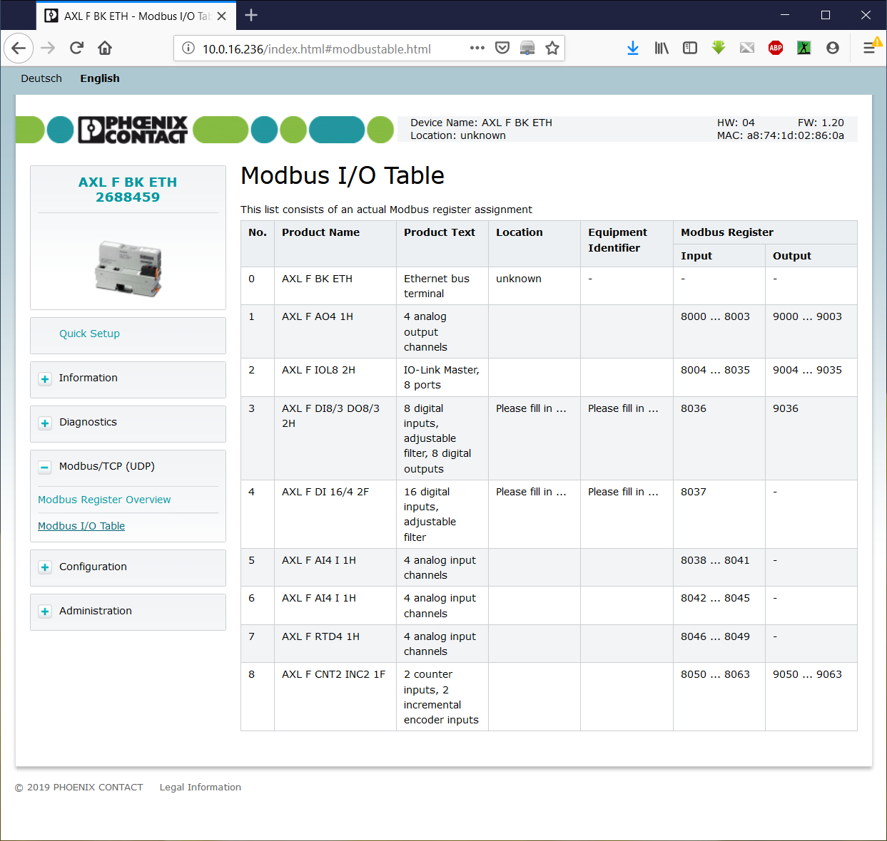
<p align="center"> Рис. Конфигурация шины Axioline F</p>
